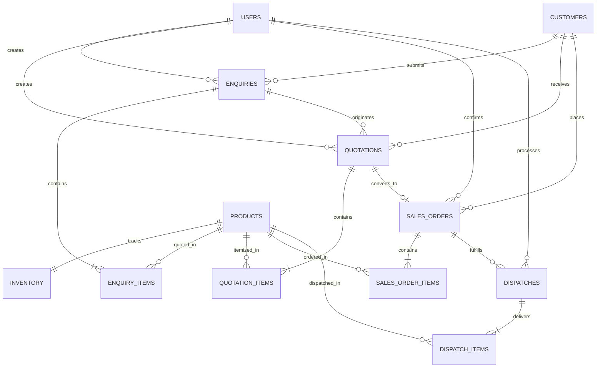

# 🏭 Industrial Manufacturing & Supply ERP (PERN Stack)

A lightweight, enterprise-grade Operations ERP application built with the **PERN stack (PostgreSQL, Express.js, React.js, Node.js)** implementing the complete B2B industrial order fulfillment lifecycle:

$$\textbf{Customer Enquiry} \longrightarrow \textbf{Quotation} \longrightarrow \textbf{Sales Order} \longrightarrow \textbf{Inventory Reservation} \longrightarrow \textbf{Dispatch}$$

---

## 📑 Table of Contents
1. [Tech Stack](#-tech-stack)
2. [Key Architecture & Concurrency Safeguards](#-key-architecture--concurrency-safeguards)
3. [Test Login Credentials](#-test-login-credentials)
4. [Local Project Setup & Running](#-local-project-setup--running)
5. [Automated Testing Suite (6 Passed Tests)](#-automated-testing-suite)
6. [Docker Single-Command Deployment](#-docker-single-command-deployment)
7. [Database Schema & ER Diagram](#-database-schema--er-diagram)
8. [REST API Documentation](#-rest-api-documentation)

---

## 🛠 Tech Stack
- **Database:** PostgreSQL 16 (Relational modeling, row-level locks, CHECK constraints)
- **Backend:** Node.js (v20 LTS), Express.js, TypeScript, JWT (`jsonwebtoken`), Password Hashing (`bcryptjs`), Connection Pooling (`pg`)
- **Frontend:** React 18, Vite, TypeScript, Tailwind CSS v4, Lucide React Icons
- **Testing:** Jest, Supertest, ts-jest
- **DevOps:** Docker, Docker Compose, Multi-stage Dockerfiles, Nginx

---

## 🔒 Key Architecture & Concurrency Safeguards

### 1. Simultaneous Inventory Reservation Race Condition Solution
* **Problem:** Available inventory = 100. User A tries to reserve 80 and User B tries to reserve 50 almost simultaneously. Both see 100 available stock. If both succeed, `Reserved = 130` (overselling by 30 units).
* **Technical Solution:**
  1. **PostgreSQL Row-Level Locking:** In `order.service.ts`, `SELECT physical_quantity, reserved_quantity FROM inventory WHERE product_id = $1 FOR UPDATE` locks the specific product row inside an active ACID transaction. User B is blocked at the database kernel level until User A commits or rolls back.
  2. **Database CHECK Constraint:** `CONSTRAINT check_reservation_limit CHECK (physical_quantity >= reserved_quantity)` enforces at the storage engine level that stock can never be over-reserved.
  3. **Stock Segregation:** During reservation, **physical stock remains unchanged**; only `reserved_quantity` increases.

### 2. Dual Stock Decrement on Dispatch
When the Admin dispatches a confirmed order:
$$\text{Physical Quantity}_{\text{new}} = \text{Physical Quantity}_{\text{old}} - \text{Dispatched Quantity}$$
$$\text{Reserved Quantity}_{\text{new}} = \text{Reserved Quantity}_{\text{old}} - \text{Dispatched Quantity}$$
$$\text{Available Quantity} = \text{Physical} - \text{Reserved} \quad (\text{Remains unchanged})$$

### 3. Server-Side Role-Based Access Control (RBAC)
- **`ADMIN`**: Confirm Sales Orders (reserve stock), process dispatches, view all records.
- **`SALES`**: Create customer enquiries, generate quotations, convert accepted quotations to sales orders.
- *Strict Rule:* Frontend-only role restrictions are backed by server-side `requireRole('ADMIN')` middleware.

---

## 🔑 Test Login Credentials

| Role | Email | Password | Allowed Capabilities |
| :--- | :--- | :--- | :--- |
| **System Administrator** | `admin@erp.com` | `Password@123` | Confirm orders, reserve stock, process vehicle dispatches, view all records |
| **Sales User** | `sales@erp.com` | `Password@123` | Create enquiries, generate quotations, convert accepted quotations |

> **Tip:** The frontend includes **1-Click Quick Demo Switcher** buttons for instant role swapping during evaluations.

---

## 🚀 Local Project Setup & Running

### Prerequisites
- Node.js (v18 or v20 LTS)
- PostgreSQL (or use Docker Compose)
- npm or pnpm

### 1. Database Setup (PostgreSQL)
```bash
# In PostgreSQL terminal
createdb industrial_erp
psql -d industrial_erp -f backend/schema.sql
psql -d industrial_erp -f backend/seed.sql
```

### 2. Backend Setup & Run
```bash
cd backend
npm install
npm run build
npm start
# Backend runs on http://localhost:5000
# Health check: http://localhost:5000/health
```

### 3. Frontend Setup & Run
```bash
cd frontend
npm install
npm run build
npm run dev
# Frontend runs on http://localhost:5173
```

---

## 🧪 Automated Testing Suite

The suite implements the **5 mandatory case study tests** + the **bonus simultaneous concurrency test**:

```bash
cd backend
npm test
```

### Verified Test Results:
```text
PASS tests/erp_workflow.test.ts
  Industrial ERP - 5 Mandatory Tests + Concurrency Bonus Test
    ✓ Test 1: Quotation total is calculated correctly on backend (Base, Discount, GST, Grand Total)
    ✓ Test 2: Rejected/Draft quotation cannot create a Sales Order (400 Bad Request)
    ✓ Test 3: Same quotation cannot generate duplicate Sales Orders (409 Conflict)
    ✓ Test 4: Cannot reserve more than available inventory (Over-reservation rejected)
    ✓ Test 5: Sales User cannot confirm sales orders or process dispatch (403 Forbidden)
    ✓ Bonus Test: Simultaneous inventory reservations handle race condition safely

Test Suites: 1 passed, 1 total
Tests:       6 passed, 6 total
Snapshots:   0 total
Time:        5.306 s
```

---

## 🐳 Docker Single-Command Deployment

Run the complete PERN stack (PostgreSQL + Backend API + Frontend Nginx SPA) in one command:

```bash
docker compose up --build
```
- **Web Application:** http://localhost:5173
- **Backend REST API:** http://localhost:5000/api
- **PostgreSQL Database:** `localhost:5432` (`erp_user` / `erp_password`)

---

## 📊 Database Schema & ER Diagram



### Seeded Industrial Products Master
1. `IND-VLV-01`: Cast Steel Gate Valve DN50 PN16 (Base: ₹4,500 | Physical: 200, Reserved: 60, Available: 140)
2. `IND-PMP-02`: High Pressure Hydraulic Gear Pump 250 Bar (Base: ₹18,500 | Physical: 40, Reserved: 10, Available: 30)
3. `IND-CYL-03`: Double Acting Pneumatic Cylinder 100mm (Base: ₹3,200 | Physical: 150, Reserved: 25, Available: 125)
4. `IND-MTR-04`: AC Induction Motor 5.5kW (Base: ₹24,000 | Physical: 30, Reserved: 5, Available: 25)
5. `IND-FLG-05`: SS316 Weld Neck Flange 4-inch (Base: ₹1,850 | Physical: 300, Reserved: 80, Available: 220)
6. `IND-BRG-06`: Spherical Roller Bearing 22215-E (Base: ₹2,950 | Physical: 100, Reserved: 30, Available: 70)

---

## 📡 REST API Documentation

| Endpoint | Method | Role | Description |
| :--- | :--- | :--- | :--- |
| `/api/auth/login` | POST | Public | Authenticates user and returns JWT token |
| `/api/auth/me` | GET | Authenticated | Returns current profile and active role |
| `/api/inventory` | GET | Authenticated | Returns live stock: Physical, Reserved, Available |
| `/api/enquiries` | GET | Authenticated | Lists all customer enquiries |
| `/api/enquiries` | POST | SALES, ADMIN | Creates customer & enquiry with multi-product items |
| `/api/quotations` | GET | Authenticated | Lists all quotations with itemized schedules |
| `/api/quotations` | POST | SALES, ADMIN | Generates quotation with strict backend tax calculation |
| `/api/quotations/:id/status` | PATCH | SALES, ADMIN | Updates status (`DRAFT`, `SENT`, `ACCEPTED`, `REJECTED`) |
| `/api/quotations/:id/convert` | POST | SALES, ADMIN | Converts ACCEPTED quotation into Sales Order (1-to-1 guard) |
| `/api/sales-orders` | GET | Authenticated | Lists sales orders |
| `/api/sales-orders/:id/confirm` | POST | **ADMIN ONLY** | Acquires row locks, validates stock, reserves inventory |
| `/api/sales-orders/:id/dispatch`| POST | **ADMIN ONLY** | Decrements physical & reserved stock, creates dispatch |
